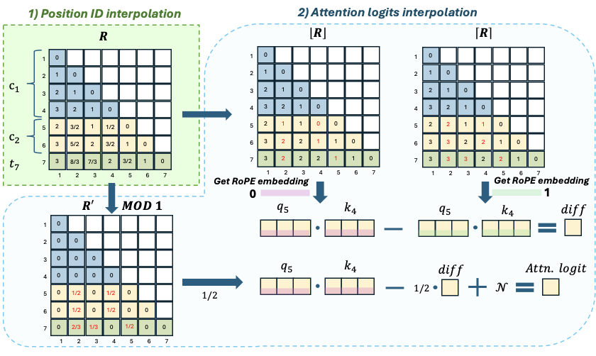

# A Training-Free Length Extrapolation Approach for LLMs: Greedy Attention Logit Interpolation


Implementation of the training-free length extrapolation method GALI in [A Training-Free Length Extrapolation Approach for LLMs: Greedy Attention Logit Interpolation](). 


## Updates
- [05/02/2024]:🎉 Open source!


## Requirements:
- Please use the versions of the libraries written in the requirements.txt.

## Implementation of Baseline Methods

**SelfExtend** [https://github.com/datamllab/LongLM]

**ChunkLlama** [https://github.com/HKUNLP/ChunkLlama]

**YaRN, NTK, Dyn-NTK Llama** [https://huggingface.co/]


## 1. Overview 
Transformer-based Large Language Models (LLMs) struggle to process inputs exceeding their training context window, with performance degrading due to positional out-of-distribution (O.O.D.) that disrupt attention computations. Existing solutions, fine-tuning and training-free methods, are limited by computational inefficiency, attention logit outliers or loss of local positional information. To address this, we propose Greedy Attention Logit Interpolation (GALI), a training-free length extrapolation method that maximizes the utilization of pretrained positional intervals while avoiding attention logit outliers through attention logit interpolation. The result demonstrates that GALI consistently outperforms state-of-the-art training-free methods. Our findings reveal that LLMs interpret positional intervals unevenly within their training context window, suggesting that extrapolating within a smaller positional interval range yields superior results—even for short-context tasks. GALI represents a significant step toward resolving the positional O.O.D. challenge, enabling more reliable long-text understanding in LLMs.

<p align="center">



## 2. How to Use GALI

### 2.1 Setup

- Install the required libraries listed in requirements.txt.

- Download the source code.

### 2.2 Get the model

We provide a GALI implementation based on LLaMA. The model modifications are implemented in models/DPI/patches/Llama.py, while additional helper functions are located in the models/DPI directory. Users can obtain a GALI-LLaMA model using the following code:

```python
from models.DPI.dpi import get_model_and_tokenizer

method = "dpi"
params = dict(use_chunk_softmax = false, chunk_coe = 3000, appro_attn = true, local_window = 128, noise_type = "gaussian", addon_relcoef = 1,std_base = 1.0, scale_mean = 0, scale_std = 1)
ori_max_position_embeddings = 8192 # The initial context window of the LLM defined in our paper.
model, tokenizer = get_model_and_tokenizer(model_name, config, method, params, max_position_embeddings=ori_max_position_embeddings)

```
Users can also utilize the get_model_and_tokenizer function in models/DPI/dpi.py to obtain other baseline models with FlashAttention, including SelfExtend, ChunkLLaMA, NTK, Dyn-NTK, and ChunkLLaMA, as used in our paper.

Additionally, we provide an alternative function for non-FlashAttention versions of each method in models/DPI/dpi_withoutflash.py.

Below is an explanation of the parameters required for each method:

- GALI:
```
method = "dpi"
params = {
    # Whether to use chunked softmax when computing attention scores. This slightly reduces peak memory usage.
    use_chunk_softmax = false, 
    # The chunk size as defined in our paper. It can also be a float, meaning the chunk size is dynamic. 
    # See details in the `get_chunk_size_list` function.
    chunk_coe = 3000, 
    # Whether to apply attention logit interpolation.
    appro_attn = true, 
    # The local window size as defined in our paper. See details in the `construct_new_pi` function.
    local_window = 128, 
    # Noise parameters used in attention logit interpolation. 
    # See details in `attention_score_approximate`.
    noise_type = "gaussian", addon_relcoef = 1,std_base = 1.0, scale_mean = 0, scale_std = 1}
```

- SelfExtend:
```
method = "repro_se"
params = {
    # The group size as defined in their paper
    group_size = 3,
    # The window size as defined in thir paper
    window_size = 4096 
    # In practice, we must ensure that (initial context window - window) * group_size + window >= target context window.
```

- ChunkLlama:
```
method = "repro_chunkllama"
params = {} # leave blank
```

- NTK:
```
method = "repro_ntk"
params = {
    # The scaling factor
    factor = 4 
    # In practice, we must ensure that initial context window * factor >= target context window.
} 
```

- Dyn-NTK:
```
method = "repro_dynamic_ntk"
params = {
    # The scaling factor
    factor = 4 
    # In practice, we must ensure that initial context window * factor >= target context window.
} 
```

- YaRN:
```
method = "repro_yarn"
params = {
     # The scaling factor
    factor = 4 
    # In practice, we must ensure that initial context window * factor >= target context window.
}
```

- Original Llama:
```
method = "repro_original"
params = {} # leave blank.
```

### 2.3 Run the experiments

We provide scripts for running experiments on LongBench, L-Eval, PG19 PPL Test, and Needle-in-a-Stack. Users can execute the following commands to run experiments and collect results:

```
# Run the experiments
python pred.py --cfg expcfg/longbench_llama2_16k_dpi.toml

# Evaluate the predictions 
python eval.py --task longbenh --exp dpi-llama2-7b-4k-to-16k

# Collect the results into the excel file
python collect_results.py --task longbenh --exp all

```
To run different experiments, simply modify the "task" parameter in the TOML config file. The required parameters for each experiment are listed below:
- LongBench: 
```
task = "longbench"
```
- L-Eval: leval
```
task = "leval"
```
- PG19
```
task = "pg19"
stride = 2000 # Split the inputs to avoid high peek memory
```
- Needle-in-a-stack
```
task = "needle"
times = 20  # Repeat 20 times for each length setting.
min_k = 1   # Minimum input length (in thousands).
max_k = 32  # Maximum input length (in thousands).
gap = 4     # Percentage interval of lengths.
```

Other important params in the config file:
```
exp_name = "dpi-llama2-7b-4k-to-16k"  # Directory for storing results generated by the LLM.
max_pe = 16384  # Target context window as defined in our paper (options: 8192, 16384, 32768).
ori_max_position_embeddings = 4096  # Initial context window as defined in our paper (options: 2048, 4096, 8192).
```
## Generating Analysis Results and Visualizations

The code for analysis and visualizations in our paper is available in the analysis_paper.ipynb file.

For attention analysis, we average the attention score or logit matrix along the head and layer dimensions:
```
[batch size, layer, head, q_len, k_len] → [batch size, q_len, k_len]
```
We have also uploaded the generated images in the ./images/ directory.

------


<!-- If you find our method useful, please kindly cite our paper.
```bibtex
@misc{jin2024llm,
      title={LLM Maybe LongLM: Self-Extend LLM Context Window Without Tuning}, 
      author={Hongye Jin and Xiaotian Han and Jingfeng Yang and Zhimeng Jiang and Zirui Liu and Chia-Yuan Chang and Huiyuan Chen and Xia Hu},
      year={2024},
      eprint={2401.01325},
      archivePrefix={arXiv},
      primaryClass={cs.CL}
}
``` -->


## 4. Contributing
We welcome contributions from the research community to improve the effeicency of SelfExtend. If you have any idea or would like to report a bug, please open an issue or submit a pull request.

## 5. License
The code is released under the MIT License.

